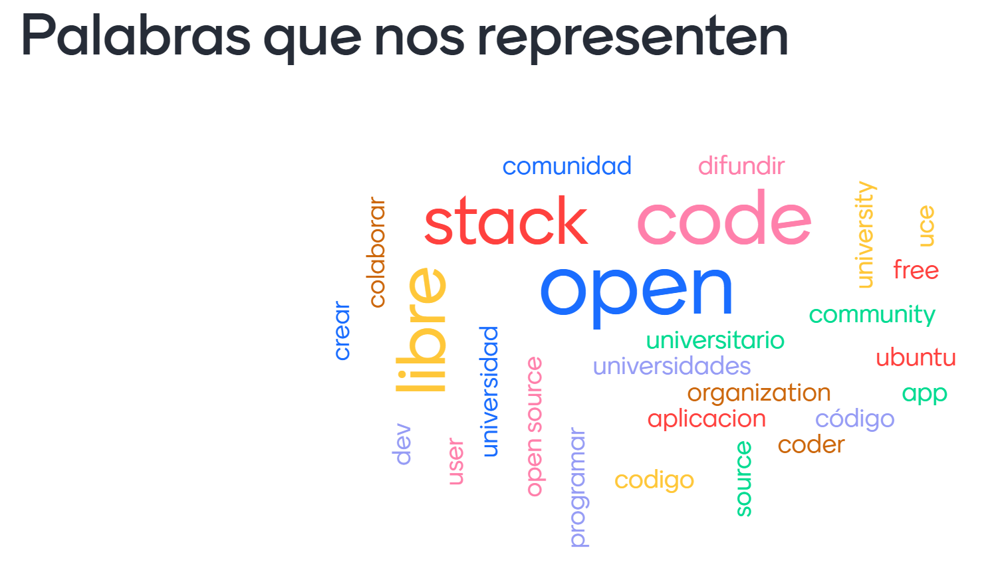

# ACTA Open Source UC 2021-04-11

## Asistentes

- Gabriel Andrés Faúndez Soto - 2016
- Benjamin Vicente - 2019
- Eugenio Cruz - 2020
- Ignacio Monardes - 2020
- Javier Zapeda Avello - 2020
- Juan Vargas - 2020
- Juan Pablo Gelmi - 2021

## Temas en tabla

- Coordinadores y grupos de trabajo
- Nombre oficial del proyecto
- Medios de comunicación y difusión (telegram, github, discord, etc)
- Recurrencia de reuniones
- Varios (permisos en github, relación con el capítulo, arreglar error meta, reunión con ex miembros)

## Nombre del proyecto

### Creación del nombre

Se establece la siguiente nube de palabras como las mas representativas del proyecto.

### Definiciones

- Se mantiene Open Source UC como nombre provisional.
- Se define hacer un form para recopilar nombres en base a la nube de ideas.

## Definición de que es una decisión

- Elementos que cambian la estructura de la comunidad.

## Medios de difusión

- Instagram como medio de comunicación publico.
- Discord como medio de comunicación interno anexo.
  - Se adjunta el badge para los repositorios

  - Se adjunta link al discord <https://discord.gg/rqmKuxXwSg>

## Grupos de trabajo

### Encargados temporales

#### Pagina web

  [Juan pablo](github.com/) y [Gabriel Andres](github.com/FarDust),  rellenar la descripción e información.

#### Ideas de grupos

- Organizadores de proyectos.
- Grupo de difusión, canales públicos y comunidad.
- Docencia, creación de guía y talleres.
- Administración, formalidades y representación.

## Problema de meta

- Borrar el título escrito 2 veces
- El meta es un borrador hasta que se defina en reunión para ratificar.

### Moción de meta como borrador

#### Rechazado por

#### Aprobada por

- Gabriel
- Benjamin
- Eugenio
- Ignacio
- Juan vargas
- Javier del valle
- Ignacio Monardes

## Permisos en github

>Eugenio: cada proyecto debería tener alguien que dirija.

## Definición de miembro

- Un miembro se define si ha participado en al menos 2 reuniones.
Si el miembro falta a tres reuniones consecutivas se resta del quórum total, denominado miembro inactivo.
- Se  define la categoría de miembro activo e inactivo, de los miembros activos se consideran para el quórum.
- Los miembros tienen derecho a voto vinculantes si son miembros activos al momento de publicar la poll.

## Métodos de votación

- Polls de telegram para votaciones con validez de 12hrs.
- En reunión se proponen mociones con mayoría simple de los miembros activos presentes en reunión.
- Las mociones se aprueban mediante votación pública y asíncrona en un medio accesible a todos los miembros activos.
- Las votaciones asíncronas son aprobadas por mayoría simple.

## Reuniones

- Al menos debe haber una reunión cada 2 semanas.
- Debe haber aviso de al menos 1 dia de anticipación.
- Cualquier miembro activo puede invocar una reunión.

## Puntos pendientes

- Aprobar Coordinadores y grupos de trabajo
- Definir nombre oficial del proyecto
- Formalizar medios de comunicación y encargados
- Permisos en github
- Relación con el capítulo de computación. (esperar a la reconstitución)
- Reunión con ex miembros.
